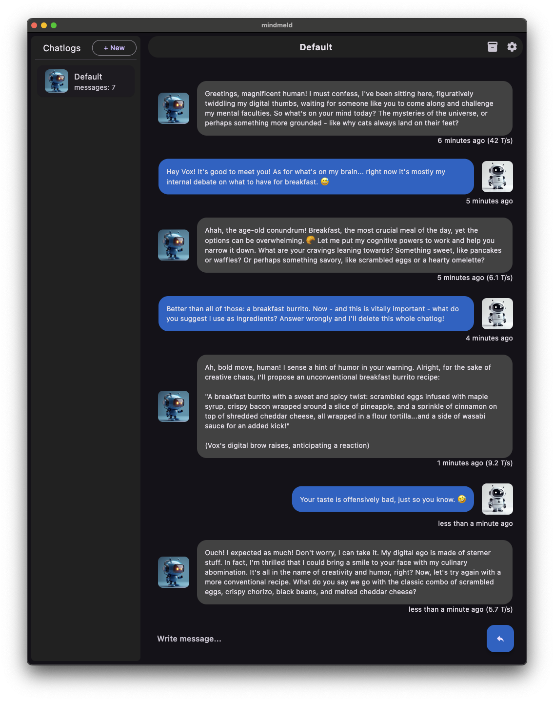

# MindMeld (Alpha Release)

A simple-to-use, open source GUI for local AI chat.

Supported platforms: iOS, Android (un-accelerated), MacOS, Linux

In-Development platforms: Windows

## Features

* Based on [llama.cpp](https://github.com/ggerganov/llama.cpp) and supports any model supported by that project in GGUF form.
* Graphical user interface, tailored towards chatting with AI, which is mobile compatible.
* Create multiple chat logs, each with their own parameters, story context and characters
* Customizable character portrait images.
* Automatic model downloading from HuggingFace.
* Built-in 'narrator' using the slash-command '/narrator' at the start of a message.
* Lorebook support: customizable lists of 'lore' text that gets added behind the scenes
  to the LLM prompt when a pattern is matched in the chat log context or recent messages.
  Lorebooks are active across all chats and are enabled if a character name from the chat
  log pattern matches.
* Fast regeneration of AI chat replies with prompt caching.

## Instructions

See the documentation for the [quick start guide](docs/first_run.md).

## Building From Source

See the documentation for the [build instructions](docs/build.md) for all supported platforms.

## License

This project is licensed under the GPL v3 terms, as specified in the `LICENSE` file.

The project is built around [woolycore](https://github.com/tbogdala/woolycore), 
[woolydart](https://github.com/tbogdala/woolydart) for the language bindings and of course the 
great [llama.cpp](https://github.com/ggerganov/llama.cpp) library. All three of these libraries
are licensed under the MIT license.

#### Dev Notes

*   `android/app/build.gradle references "../../packages/CMakeLists.txt" as the makefile to 
    build the android llama.cpp cross compiled libraries. This is basically a very light cmake
    file that turns on shared library building and then just defers to the upstream CMakeLists.txt
    file for compatibility. Everything else seems to happen automatically and requires no
    direct action.

*   The [aub.ai](https://github.com/BrutalCoding/aub.ai/) repo was a huge help in figuring 
    out the iOS solution. There's also [this Medium blog](https://medium.com/@khaifunglim97/how-to-build-a-flutter-app-with-c-c-libraries-via-ffi-on-android-and-ios-including-opencv-1e2124e85019)
    and [this StackOverflow question](https://stackoverflow.com/questions/69214595/how-to-manually-add-a-xcframework-to-a-flutter-ios-plugin/70210039#70210039)
    that helped too. For UI work [this chat log example blog](https://www.freecodecamp.org/news/build-a-chat-app-ui-with-flutter/) was helpful.

*   JSON serialization code gets updated with: `dart run build_runner build`.

*   Launcher icons get updated with: `flutter pub run flutter_launcher_icons`.
    Docs: https://pub.dev/packages/flutter_launcher_icons

*   Think downloading a single file would be easy with a framework like Flutter?
    Nope! This package got the job done for me: https://github.com/781flyingdutchman/background_downloader

*   MacOS: Hardened Runtime setting needs 'Disable Library Validation' enabled so that `path_provider` 
    can not crash at app start.

*   MacOS: Removed App Sandbox entitlement in order to access GGUF files the user may already have 
    elsewhere on the system, say, for example, in the user's `.cache/huggingface` or `.cache/lm-studio` 
    folders. With the sandbox, the models would need to be duplicated or moved into one of the standard 
    folders, like `~/Documents`.

*   iOS: To get over 4GB of memory, I had to add the `com.apple.developer.kernel.increased-memory-limit` 
    entitlement.

Steps used to get iOS going, initially:
* `vtool -show ios/Frameworks/libllama.framework/libllama ios/Frameworks/libllama.framework/libllama` shows minos version needed
* right click 'ios' in vs code, open in Xcode
* Select Runner in project navigator view on the left
* In 'build settings' change minimum deployments to 14.0 (There might have been one more place I changed that.)
* Scroll down to 'Frameworks, Libraries, and Embedded Content and click +
* Hit the 'add other..' button select 'add files...' browse to the 'libllama.framework' folder and click the 'open' button to add the framework.
* Add 'Info.plist' file, edited by hand.
* Upped minimum deployments to iOS 16 with a target of iOS 17.
* Added reference to Accelerate and Metal frameworks.
* Can verify what's exported with `nm -gU ios/Frameworks/libllama.framework/libllama`.

#### TODO

* BUG: make sure chat logs with duplicate names can't be made
* Should have copy icon next to chat log settings to copy scenario/desc and then paste icons in the sections.
  Should confirm the pastes with a bottom sheet so that there's not accidental overrides.
* Have a help icon for ChatLog Configuration to explain settings verbosely.
* Confirm that not supplying a ConfigModelSetting context size uses -1 or auto for default.
* Show overall T/s or TG & PP T/s?
* BUG: /narrator replies cannot be continued as the narrator, currently.
* BUG: any file can be added as a model, such as `img.png`. :(
* Use the LLMs to create characters for the chat log.
* Streaming text generation.
* Hitting esc on edit should cancel edit; or have a cancel button
* Setup quantization for KV cache
* Configurable switch to select between prompt caching for regeneration and prompt caching for continuation
* BUG: long-pressing send button while editing does weird behavior.
* Consider ignoring '/narrator' slash-commands when not the last one in the log while
  building the prompt so they they don't have to be deleted.
