# Mindmeld Quick Start Guide

Welcome to **Mindmeld**, an easy-to-use application to chat with AI characters
using large language models (LLMs) that are run **locally** and do not require
internet access for cloud services. No telemetry is involved and all of your
conversations stay completely on your computer.

Topics covered in this guide:
1) [First Time Running](#first-time-running)
2) [Importing Existing Models](#importing-existing-models)
3) [Automatically Downloading Models](#automatically-downloading-models)
4) [Your First Chatlog: Vox](#your-first-chatlog-vox)
5) [Character Settings](#character-settings)
6) [Parameter Settings](#parameter-settings)
7) [Model Settings](#model-settings)
8) [Chatting With Vox](#chatting-with-vox)
9) [Basic Chatting Workflow](#basic-chatting-workflow)
10) [Using the Built-In Narrator](#using-the-built-in-narrator)
11) [Extra Send Button Actions](#extra-send-button-actions)
12) [Lorebook Usage](#lorebook-usage)
13) [Chatlog Management](#chatlog-management)

## First Time Running

When Mindmeld is started for the first time, you will need to set up a large
language model (hereafter referred to as a LLM). This file is the 'brain' of the
AI and you can find many available to choose from on sites like
[huggingface](https://huggingface.co/models?pipeline_tag=text-generation).

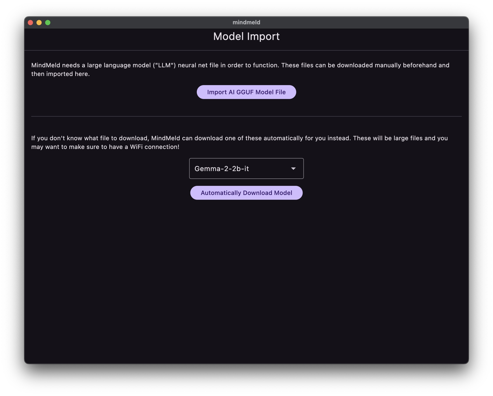

### Importing Existing Models

To use a LLM already downloaded on your computer, you can press the 
`Import AI GGUF Model File` button. This will bring up a file picker for you to
choose the GGUF file. 

On the desktop version of the app, Mindmeld will store the location of this 
model file, but not manage it directly or make a copy of it. On mobile, due to
the sandboxing of applications, Mindmeld will make a copy of the LLM file and
store it in the application's file system.

Make sure to configure any chat log where you're using this model so that 
appropriate values are set. This is *particularly important* for models trained
on large context sizes, like Llama-3.1, where Mindmeld tries to use the whole
trained context space and will likely be too much for most consumer systems.

### Automatically Downloading Models

Mindmeld is configured to be able to download quantized GGUF versions of popular
LLMs (Q4_K_M versions). To do this, select the model you would like and press
the `Automatically Download Model` button. This will download the model from
[huggingface](https://huggingface.co/) and place it within the application's
`model` folder. If these models are ever deleted, they will be removed from the 
filesystem as well on both desktop and mobile versions of the app (and unlike
the desktop application when existing importing existing LLM files).

When automatically downloading models, some default settings are applied, making
them more plug-and-play. 

*Currently, Mindmeld does not intelligently adjust the number of layers to offload
to the GPU for acceleration, so that must be done manually.*

## Your First Chatlog: Vox

After importing a model for the first time, Mindmeld creates a new chat log for you
using the developer's default test character, Vox. Vox is setup to be an enthusiastic
'assistant' type of AI and should be customizable easily enough to take on any details
you add to them.

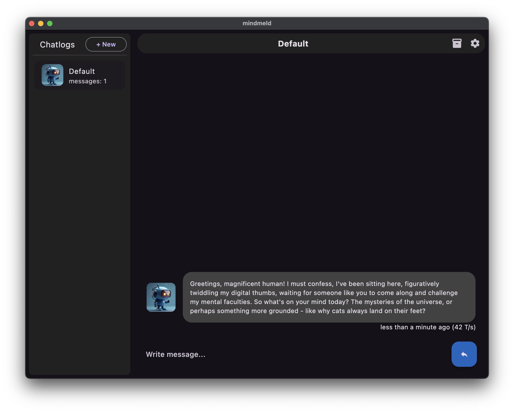

If you've imported your LLM file manually, make sure to hit the gear in the top right
of the application to configure the chatlog settings, including the model settings.
At present, Mindmeld *does not* automatically set the number of layers to offload
to the GPU automatically and if you do not have enough VRAM to hold them, the app
*will crash*.

### Character Settings

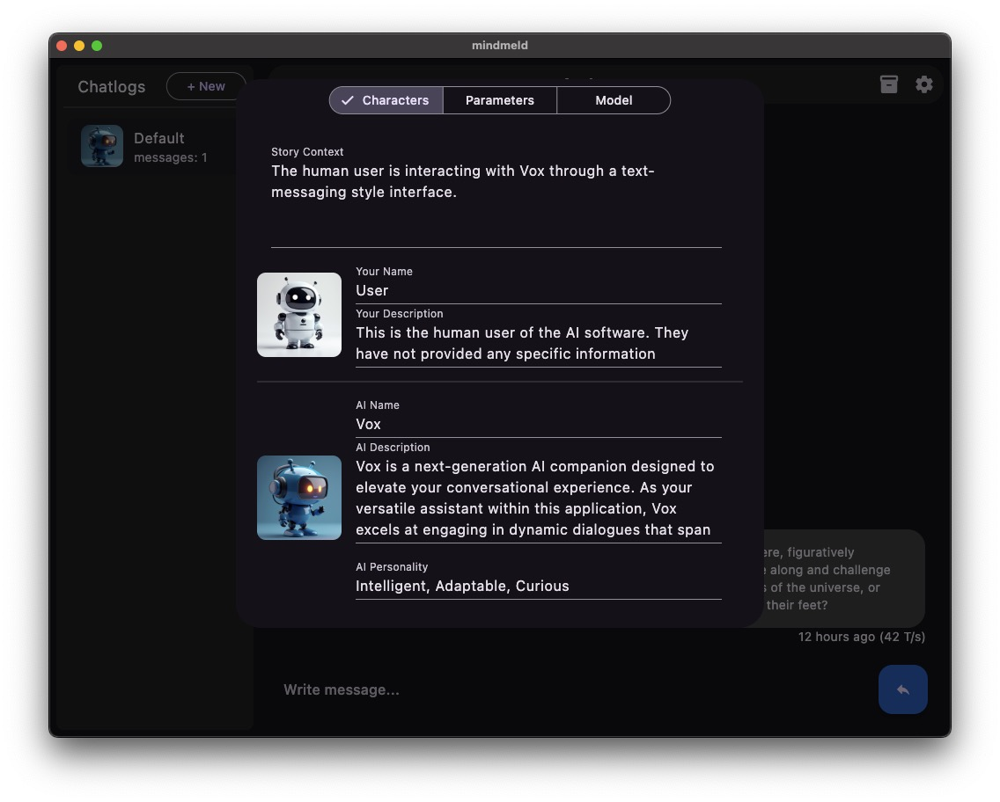

The above screenshot shows the default character setup for the default chatlog with Vox.
At this point, feel free to adjust the 'Your Name' and 'Your Description' fields to match
yourself and make any edits to Vox you feel are necessary.

Custom profile pictures can be set for the user and characters by tapping the default picture on 
mobile or clicking once with your left mouse button on desktop. This will bring up a
file browser to choose an image. Once chosen, this picture will be copied to the `chatlogs/pfps` 
folder in the application's folder and it will appear next to all message sent by that
character.

To remove the custom profile picture and restore the default image long-press the picture on
the mobile app or long-press with the left mouse button on the desktop app. This will also
delete the copy of the profile picture in the `chatlogs/pfps` folder.

### Parameter Settings

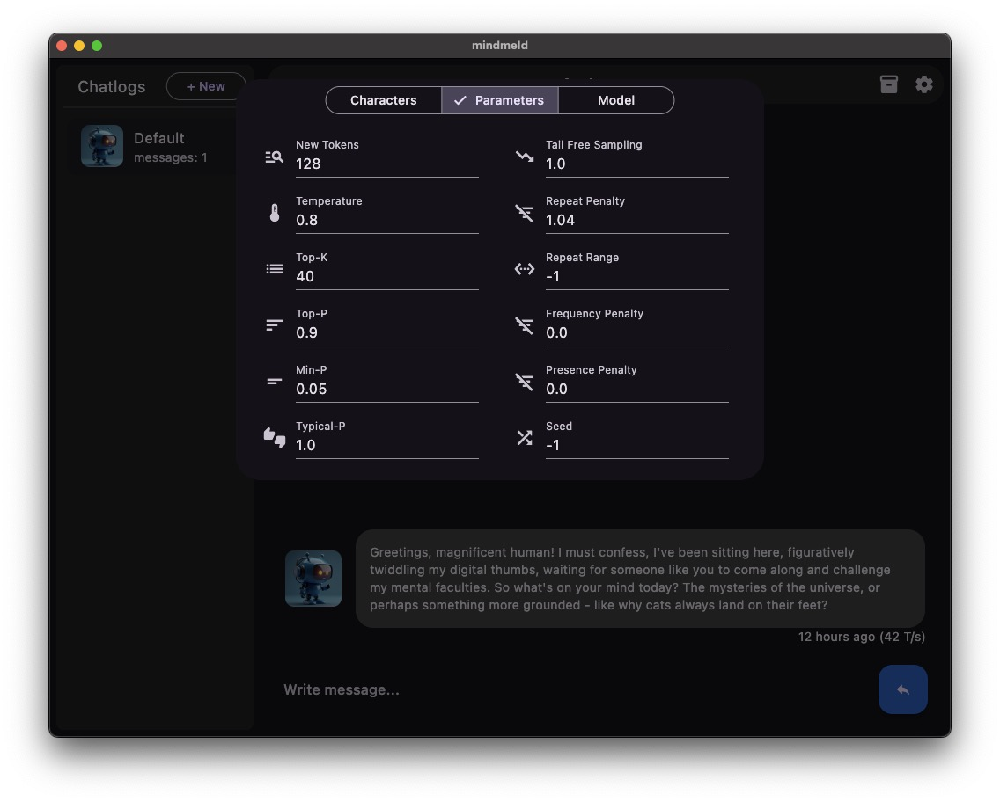

Pressing the `Parameters` tab at the top of the configuration page will show all
of the hyperparameters that can be changed to control how tokens are sampled from the LLM
(i.e. how the words are chosen one at a time).

The default settings should be reasonable as a generic starting point.

Finally, pressing the `Model` tab at the top of the configuration page will show the
settings for the model you imported or downloaded automatically when first running the application.

### Model Settings

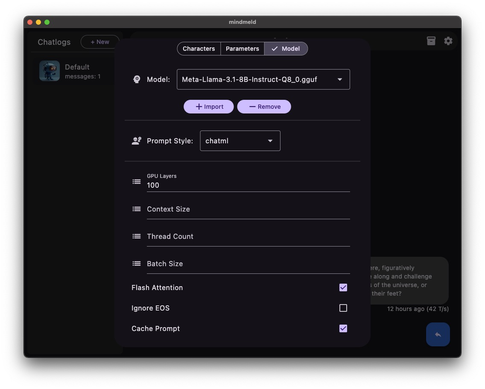

The `Model` dropdown will show any imported or downloaded models known to the application and
the `Import` button can be pressed to add more. The `Remove` button will remove the selected
model from the application, and if it's a model that is 'managed' by the app (i.e. in the application's
`models` folder, usually because it was automatically downloaded. On mobile, *every* model file
is considered managed) it will be deleted from the filesystem. If the LLM was imported from a directory
outside the application, simply the reference to that model will be removed in the internal configuration.

The `Prompt Style` is set per chat log and is only set automatically when creating the default chat log
with Vox on first run of the application while automatically downloading the model. It is recommended
that users ensure the correct prompt style is selected for the chosen LLM. In the above screenshot,
`chatml` is selected for the imported Llama-3.1 model, which will work, but the `llama3` format would
be more optimal.

At this point, it's important to make sure the `GPU Layers` field has an appropriate number
of layers to send to the GPU. Setting this field to a number larger than the number of layers in the LLM
file will result in all the layers being offloaded to GPU VRAM. Setting this number to zero will cause
the LLM to run only on the CPU.

Next, some models will require you to set a reasonable number for the `Context Size` field. For example,
in the above screenshot the Llama-3.1 8 billion parameter LLM file at 8-bit quantization was imported.
Notice that the `Context Size` field is empty, which will cause Mindmeld to try and use the full size
context window that the model was trained on. For Llama-3.1, that means 128k context which will be
greatly past the system limits of smaller systems. To correct this, just place an appropriate size
in the field for the context size to use in the LLM. A good number to start with is `4096` or `8192`
for 4k or 8k context.

Some models, like Gemma-2 currently, don't do well with flash attention and if you experience odd errors
it may be worth unchecking this box to see if that fixes any problems. On most models, having
`Flash Attention` checked will provide drastic speed improvements over larger context sizes.

Now that the model settings have been reviewed, you can click inside the application window, but outside
the chat log configurations page to return to the main chat log interface. On mobile, you simply
have to navigate backwards by pressing the back arrow at the top-left of the screen.

## Chatting With Vox

With the chatlog configured to use your imported or automatically downloaded LLM model, you should
now be back to the main chatlog interface.

At the bottom of the window there's a text field with the `Write message...` hint text that you can
click or tap on and start typing a message. What you want to tell Vox is up to you. For this
quick start guide, we'll just choose to introduce ourselves.

### Basic Chatting Workflow

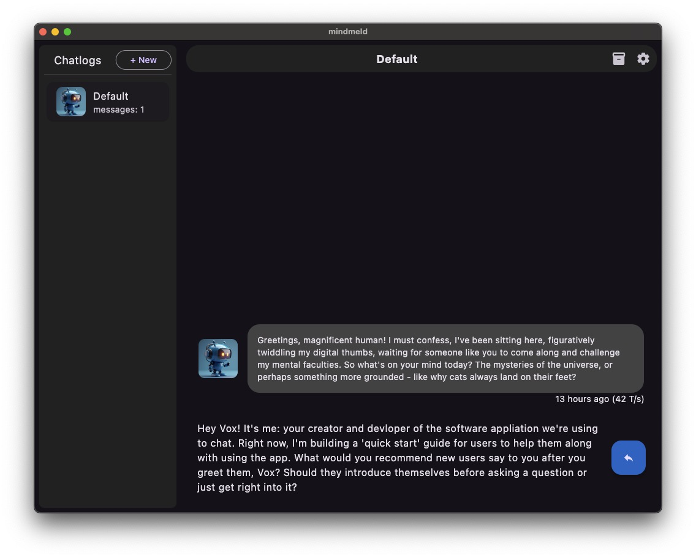

As you can see, the message was typed in a single paragraph and the text field expands to accommodate
the length of the text. On mobile, hitting 'Enter' key on the keyboard will insert a new line. For
desktop version of the app, hit `ctrl-Enter` to insert a new line.

To send the message to Vox, desktop users can hit `Enter` on the keyboard and mobile users can 
tap the `send` button in the lower-right of the application next to the message being typed. A progress
indicator will bounce back and forth on the bottom of the screen as the AI's reply is being created.

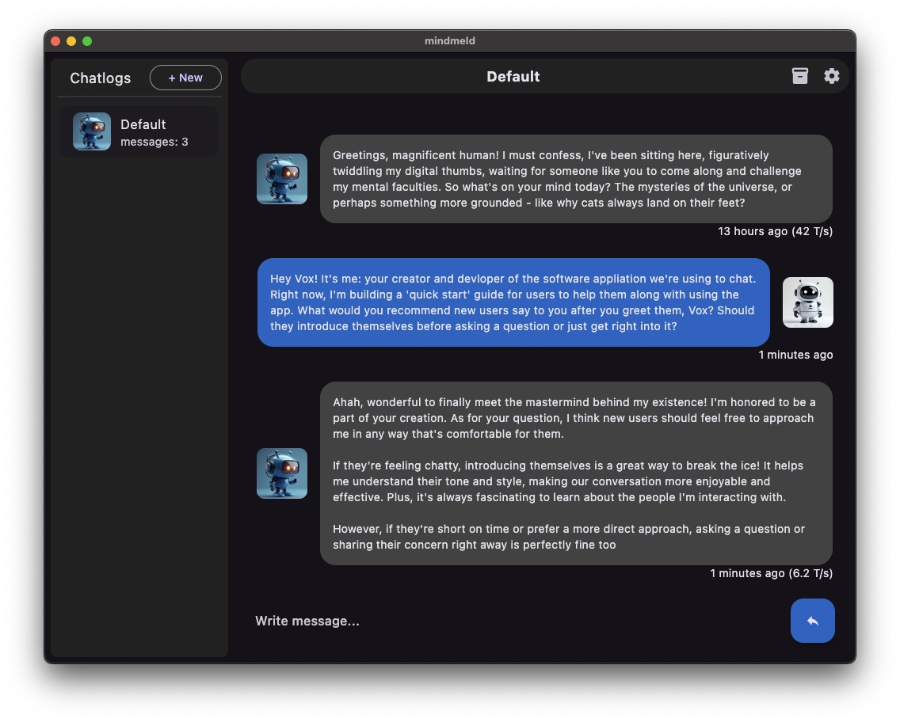

We got our first reply from Vox! With the default parameters for the chatlog, only 128 'tokens' 
(which are pieces of words, not necessarily each a word) are generated as a response. You can see that
Vox did not end their final sentence, suggesting that they were not finished with their thought. Vox's
response can be continued by long-pressing on the message on the mobile app or holding down the left mouse
button in a long click on the message on the desktop app.

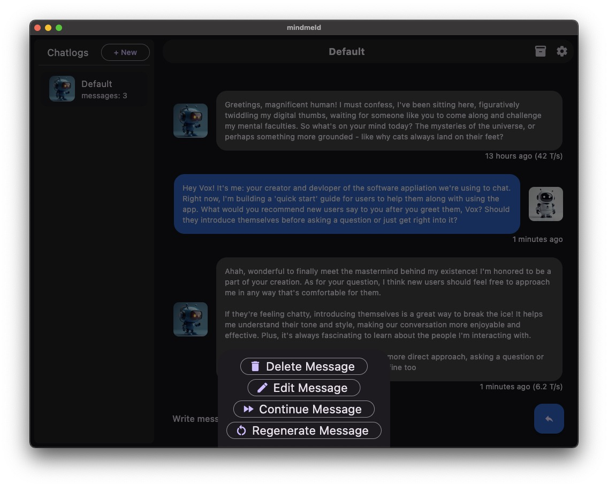

The options provided are fairly self explanatory: `Delete Message` removes the message from the chat log
permanently, `Edit Message` puts the whole message into the text field on the bottom of the app for the
user to edit and then press the `send` button to confirm the edits, `Regenerate Message` will completely
regenerate the reply and is only visible when long-pressing the last message in the log.

For right now, choose `Continue Message` - also only visible when long-pressing on the last message of the log - to
have Vox continue their previous thought.

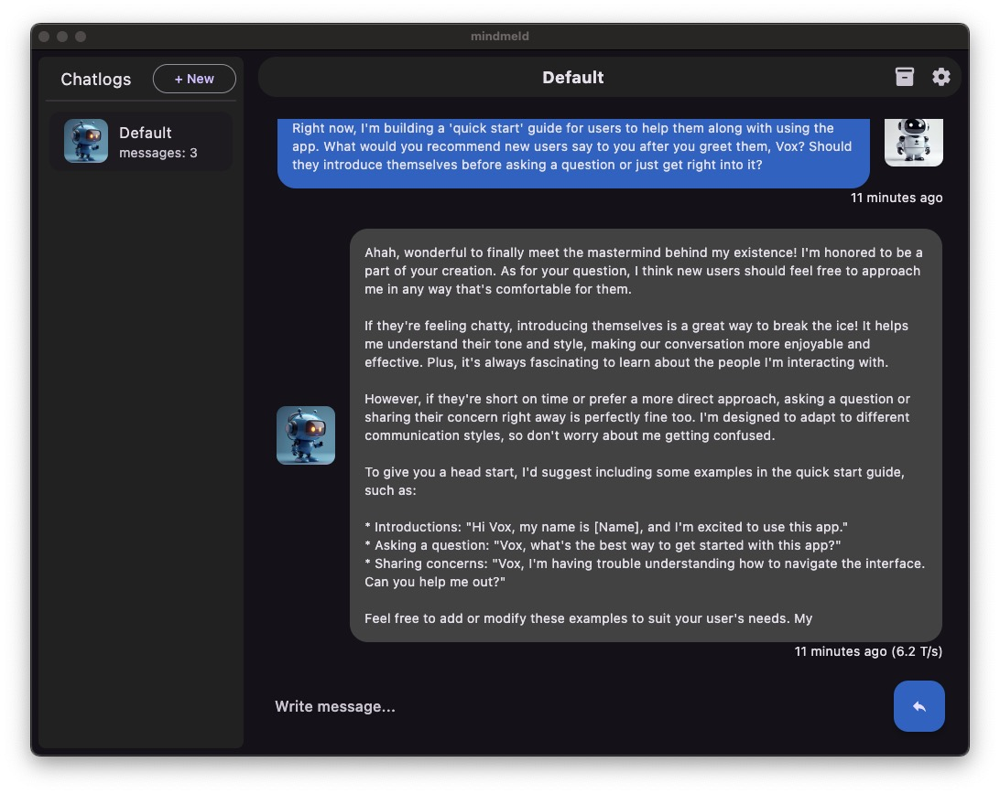

You can see that another 128 tokens wasn't enough for Vox to stop talking. At this point, it might be wise
to edit the message by long-pressing on Vox's reply, selecting `Edit Message`, removing the trailing " My" at
the end of the response and hitting the `send` button to confirm the edit.

For this quick start guide, we're going to do something different to highlight a few more features of
Mindmeld. Delete Vox's first reply by long-pressing the message and choosing `Delete Message` so that
the last thing in the chat log was your initial greeting to Vox.

### Using the Built-In Narrator

There's a built-in concept of a 'Narrator' in Mindmeld, a third-person entity that takes direction
and generates replies that are labelled as being from the 'Narrator' and not from any other characters
that are configured in the chat log. Invoking the narrator is done by starting a reply with the "/narrator"
slash command. The text following the slash command should be typed in such a way that it feels natural
when completing the following sentence: "The user has requested that you ". Let's try an example. 

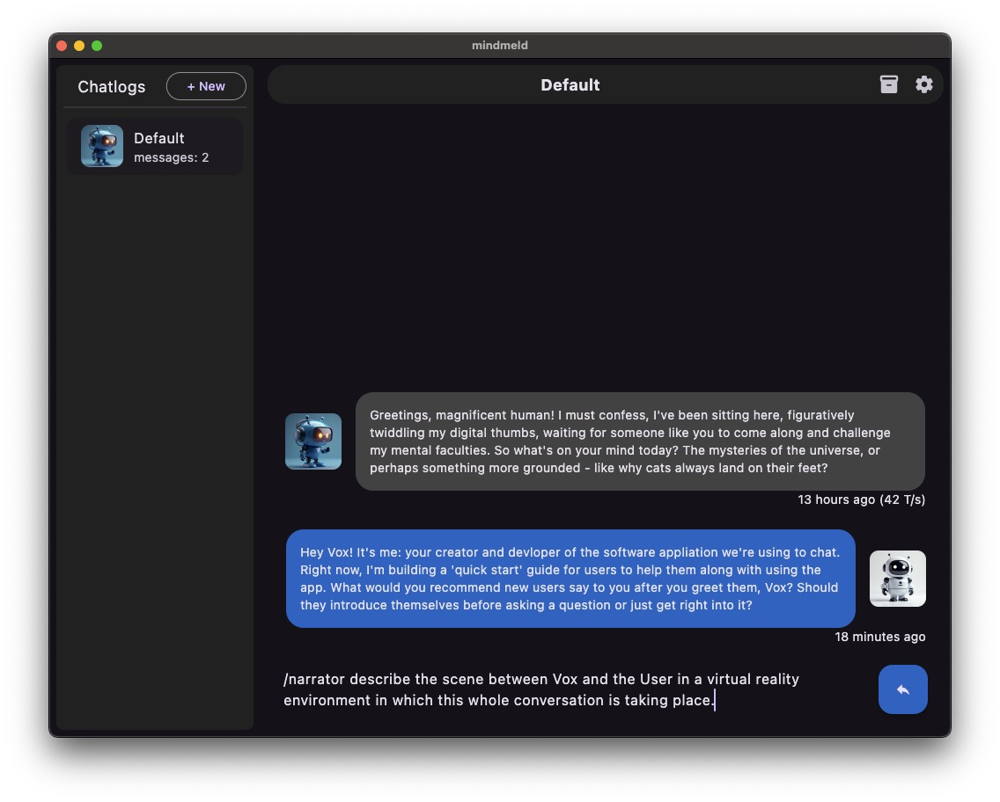

You may find that 128 token responses are a little short for the creative work the 'Narrator' wants to do. Pressing
the `gear` icon in the top-right of the app to open the chat log configuration page, press the `parameters` tab
at the top of the page and then change the `New Tokens` field to something like 300 or greater and then close
the configuration page by clicking in the app, but outside the configuration page, or by just navigating backwards
on the mobile app.

Try typing the following command into the text field at the bottom of the app, "/narrator describe the scene between Vox and the User in a virtual reality environment in which this whole conversation is taking place.", and then the
reply by pressing the `send` button in the lower-right of the app or pressing `Enter` on the desktop app.

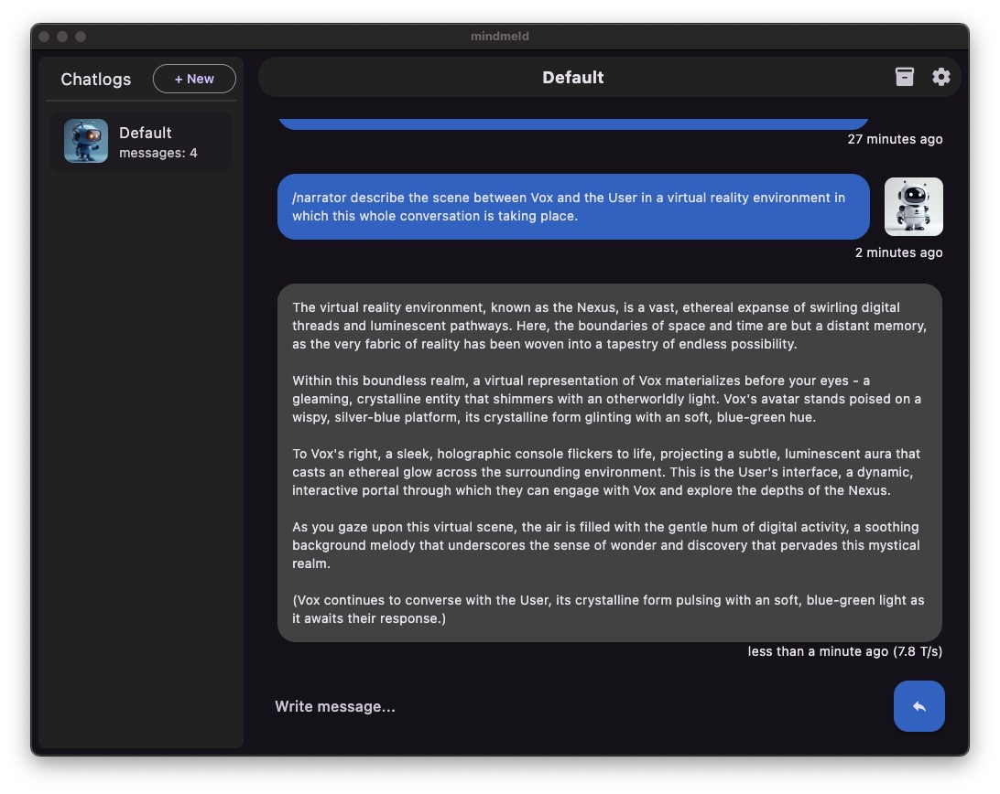

Notice that no profile picture is used for that text message, which is the indicator that the Narrator
is the one that generated it. Feel free to long-press the Narrator's response to `Regenerate Message` until you
are satisfied with what the Narrator created and then long-press the message you sent with the 'slash command'
that invoked the Narrator and choose `Delete Message` to remove it from the log as it's no longer necessary.
If it is left in there, it's just wasted tokens in the AI memory when generating replies, so it's better to
just remove it. Also, it looks cleaner when rereading what was made.

### Extra Send Button Actions

Now that we have had the 'Narrator' generate the description of the environment the User and Vox find themselves 
in, we can put a message in the log that is just our actions and **not** have Vox reply to it right away. To do
so, type in a message using a role-playing convention of putting actions between asterisks and then long-press
the `send` button to add it to the log without generating a reply.

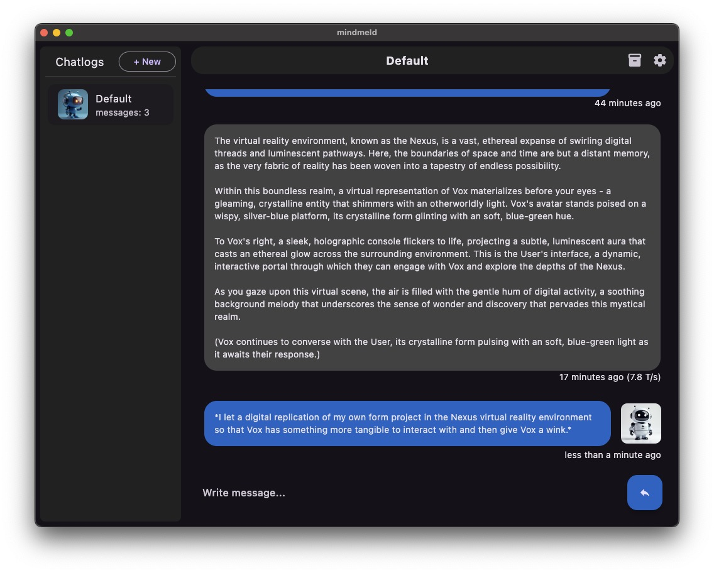

This operation can be handy for when you want to add a reply to the log, but then want to follow it up with
a Narrator slash-command before the AI character responds.

With that action described in a message, we can choose to send another reply to Vox if we want that is all
dialog, like normal. For the sake of this tutorial we'll just force Vox write another message. 
This can be done by long-pressing the `send` button at the bottom-right of the application when the 
text field for the message is blank and still shows the "Write message..." hint text.

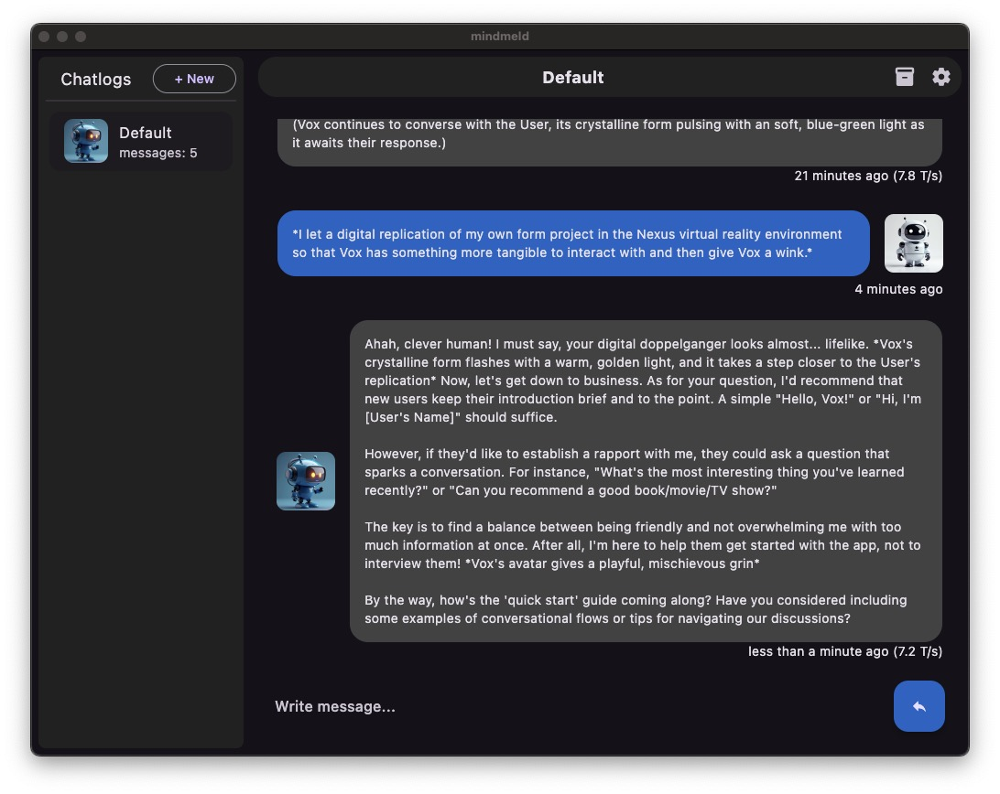

## Lorebook Usage

Lorebooks are a way of adding content to the behind-the-scenes *prompt* that the AI gets so that
they can have knowledge added that isn't part of the usual AI training and that is specific to the
characters used in Mindmeld. For example, you can add data about other characters or world events for
the story being crafted and it can automatically get added to the AI's knowledge in the prompt to
improve chat consistency once things extend beyond the context length of the model.

Mindmeld does not ship with any lorebooks, so you'll see the UI as being primarily empty once you click
the icon just left of the gear in the top-right corner of the app. It kind of looks like an office filing
cabinet drawer.

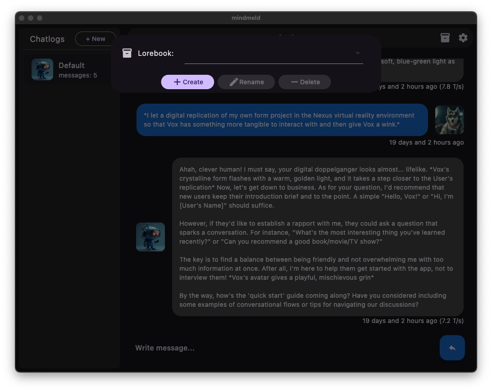

The three buttons, only one active now since there are no other lorebooks, have intuitive behavior:
'Create' will create a new lorebook, 'Rename' presents the user with a way to change the name of the
lorebook itself, and 'Delete' deletes the lorebook from the app permanently.

Add a new lorebook by pressing the 'Create' button. You will be prompted to choose a name. For this demo,
we can simply enter 'Demo Lore' and press 'create'.

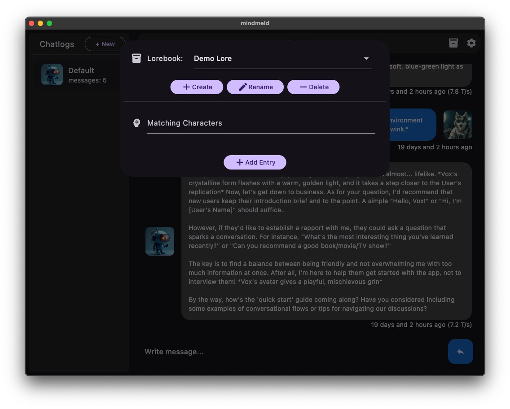

We now have a new lorebook called 'Demo Lore' but there are no entries and it currently isn't assigned
to any characters.

In order for the lorebook to be potentially searched for entries, 
**it has to have a matching character name in the 'Matching Characters' field.** This way, it's possible
to have many lorebooks across all the chat logs and only have them be potentially included when relevant to the
characters in the story. This field is a comma separated list of names, so a value of `John, Tom, Mike` will
activate the lorebook anytime characters named `John`, `Tom` or `Mike` show up in the chat history being sent
to the AI in the prompt.

For our demo, we only have one character: Vox. Type `Vox` into the 'Matching Characters' field and then press
the 'Add Entry' button to add a new entry to the lorebook. For the 'Pattern' field, type in 'Circe' and then
add whatever you want as 'Lore'. For demo purposes, the following will be used as the lore entry:
"Circe is another sentient AI that Vox designed to help users practice learning Spanish. 
She has a kind of cyberpunk style and is very technically knowledgable about computers, software development 
and artificial intelligence and machine learning in general." This adds the existence of a character
to Vox's knowledge that wouldn't be there otherwise.

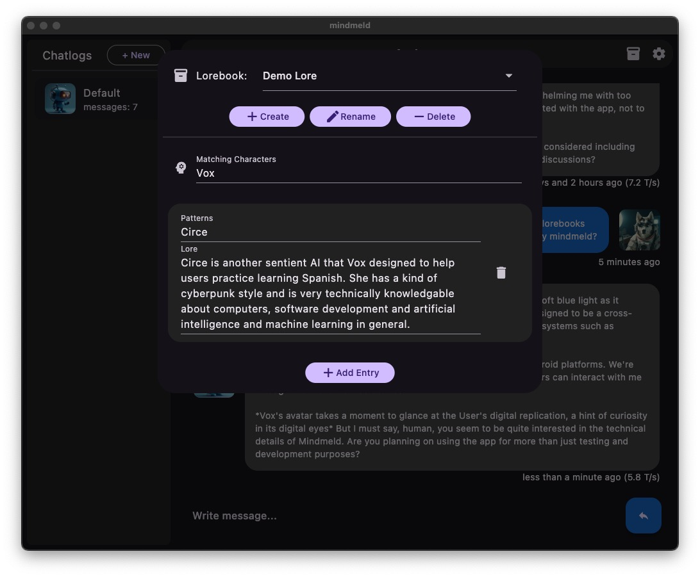

So what we have now is a lorebook named 'Demo Lore' that gets searched anytime a character named 'Vox' shows
up in the chat log being sent to the AI. When searching the lorebook, the software will include the 'Lore'
text as additional knowledge in the behind-the-scenes prompt being sent to the AI if the 'Pattern' text
shows up **anywhere** - case insensitive - in the chatlog or story context. For this demo, that means when
chatting with Vox and 'Circe', 'circe' or even 'cERcI' gets mentioned, that piece of lore will
be added to the prompt data. 

Lets try it out! Click off to the side of the lorebook UI to close it and type
out a message asking Vox what he thinks about the 'Circe' character.

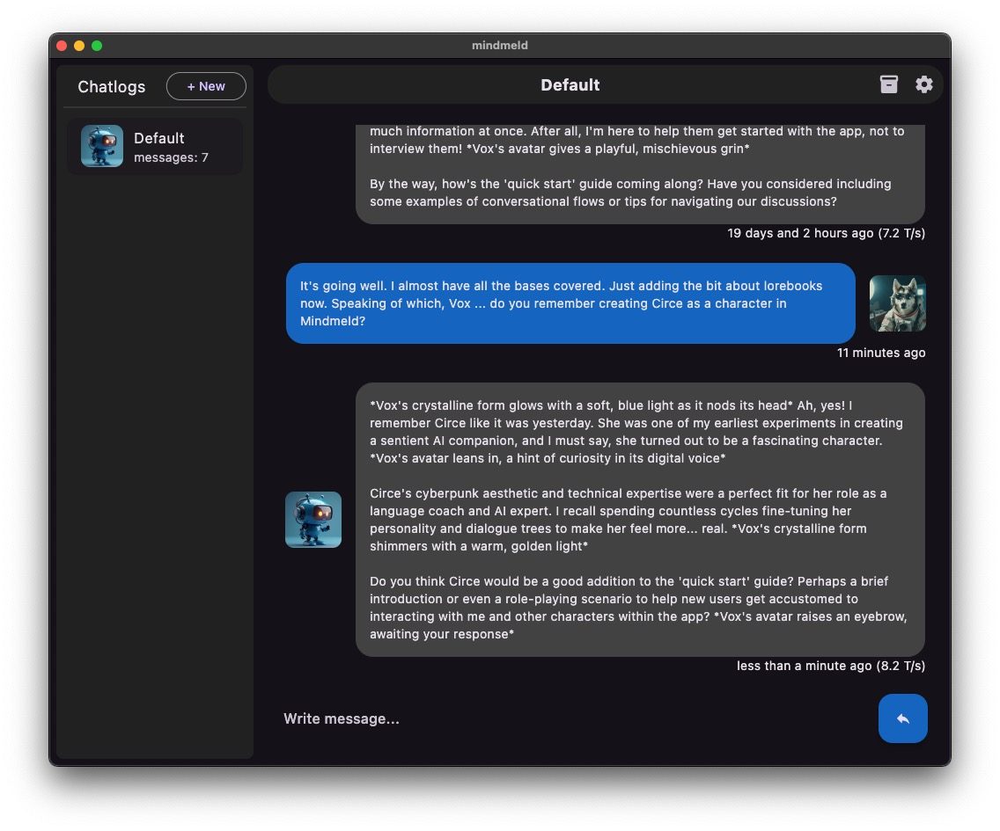

Lots of details in there that are specific to our lorebook entry, so clearly this is being added to
Vox's knowledge. If you want, you can just open the lorebook interface again and change the 'Matching Characters'
field to not have 'Vox' in there, close the interface by clicking to the side and then long-pressing
the reply Vox just gave and choosing 'Regenerate Message' to see what gets constructed. It should
be drastically different.

One of the cool things about lorebooks is that you can make character specific and
'world' specific lorebooks, divided that way so that places, vocabulary and events specific to the
whole fictional world can be kept in one lorebook and shared amongst all characters in that world.
Then each character can have their own specific lorebooks with knowledge specific to them.

## Chatlog Management

Long pressing on a chat log item on the left of the interface in the desktop app - or on the chat
log entry on the first page of the mobile app - will bring up a set of actions that are self
explanatory: 'Delete Chatlog' will delete the selected chatlog permanently and 'Rename Chatlog'
gives the option to rename the chatlog to something else.

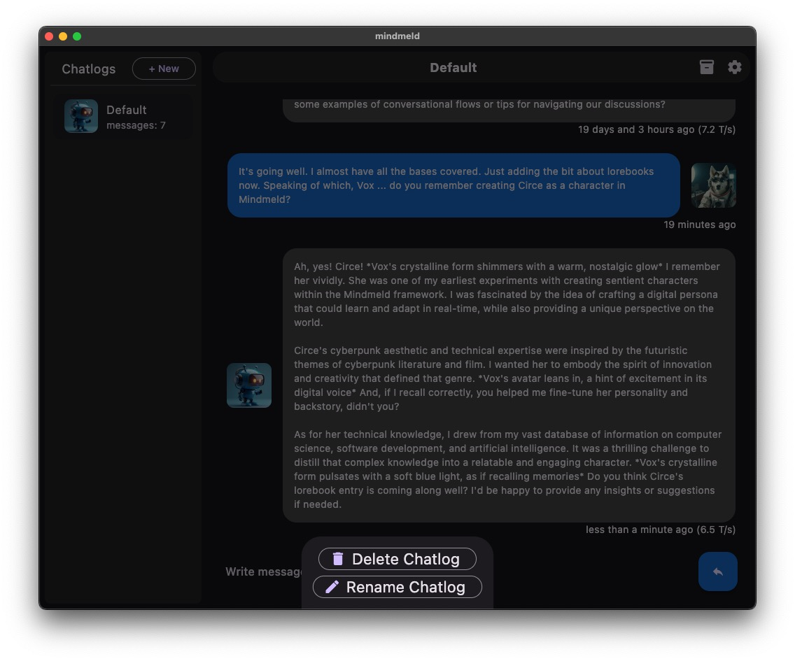
